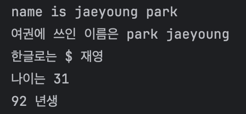
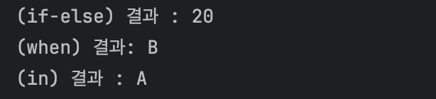

# 코틀린 시작하기
  - **`Java`와 다른 부분만 추가합니다.**
***


>## 1. 변수 선언 키워드
`val` : 변수를 선언할 때 지정한 값에서 더 이상 변경하지 않아야 하는 경우 (Ex : final 변수)
<br>`var` : 변수의 값을 바꿔야 하는 경우

- 구조 : (변수선언키워드) (변수이름) : (데이터타입) = (값)
  - ex) `val name : String = "재영"`


* 데이터타입은 생략 가능 (Optional) : 자동으로 추론하여 데이터타입을 주입
  * ex) `val name = "재영"` 

### 출력 방법
`println("print value : $name")` : `$기호`를 사용하여 선언된 변수를 사용 가능

### 코드
```Kotlin
 /*
  * var : 가변 변수
  * 데이터 타입 명시 O
  */
  var nameEng: String = "jaeyoung park"
  println("name is $nameEng")

  /* 변수 변경 */
  nameEng = "park jaeyoung"
  println("여권에 쓰인 이름은 $nameEng")

  /*
  * val : 불변 변수
  * 데이터 타입 명시 X
  */
  val nameKor = "재영"
  println("한글로는 $ $nameKor")

  /*
  * var : 가변 변수
  * 데이터 타입 명시 X
  */
  var age: Int = 31
  println("나이는 $age")

  /* 변수 변경 */
  age = 92
  println("$age 년생")

```

### 실행결과

***
> ## 2. 조건문

### `if-else 문`
- `if-else 문`은 자바와 유사하지만, `표현식(Expression)`으로 사용될 수 있다

```kotlin
val max = if (a > b) a else b
```

### `when 문`
`when 문`은 자바의 switch-case 문과 유사하지만, `더 많은 기능`을 제공
```
val score = 85
val grade = when (score / 10) {
    9 -> "A"
    8 -> "B"
    7 -> "C"
    else -> "D"
}
```

- `다양한 파라미터 사용 가능`: 정수형 변수뿐만 아니라 문자열, 연산식 등 다양한 파라미터를 사용할 수 있다.
- `값 반환 가능`: 각 when 절에서 값을 반환할 수 있어 변수에 저장할 수 있다.
- `Null 처리 가능`: Null을 가질 수 있는 파라미터도 처리할 수 있다.
- `조건식 사용 가능`: true/false를 반환하는 조건식도 사용할 수 있다.

### `in 연산자`
   코틀린에서는 in 연산자를 사용하여 범위 조건을 쉽게 확인할 수 있습니다.
```kotlin
val score = 85
if (score in 90..100) {
    println("A")
} else if (score in 80..89) {
    println("B")
} else {
    println("C")
}

```
- score in 90..100은 score가 90 이상 100 이하인지 확인하는 조건식
- in 연산자를 사용하면 범위 조건을 더 간결하게 표현
### 코드
```kotlin
  /* if-else 문 */
  val a = 10
  val b = 20
  val max = if (a > b) a else b
  println("(if-else) 결과 : $max")

  /* when 문 */
  val score = 85
  val grade = when (score / 10) {
      9 -> "A"
      8 -> "B"
      7 -> "C"
      else -> "D"
  }
  println("(when) 결과: $grade")

  /* in 연산자 */
  val num = 97
  print("(in) 결과 : ")
  if (num in 90..100) {
      println("A")
  } else if (num in 80..89) {
      println("B")
  } else {
      println("C")
  }
```
### 실행결과

***